# Diagramas de Flujo - Liscov Project Management

## Tabla de Contenidos

1. [Autenticación y Registro](#1-autenticación-y-registro)
2. [Gestión de Proyectos](#2-gestión-de-proyectos)
3. [Gestión de Sprints](#3-gestión-de-sprints)
4. [Gestión de Historias de Usuario](#4-gestión-de-historias-de-usuario)
5. [Gestión de Tareas](#5-gestión-de-tareas)
6. [Sistema de Comentarios](#6-sistema-de-comentarios)
7. [Flujos Administrativos](#7-flujos-administrativos)

---

## 1. Autenticación y Registro

### 1.1 Flujo de Login


**Descripción:**
1. Usuario accede a la página de login
2. Sistema muestra formulario con campos username y password
3. Usuario ingresa credenciales y envía formulario
4. Sistema valida formato del formulario
5. Si es válido, verifica credenciales contra base de datos
6. Si credenciales son correctas y cuenta está activa, crea sesión
7. Redirige al dashboard principal
8. Si hay error en cualquier paso, muestra mensaje y vuelve al formulario

---

### 1.2 Flujo de Logout


**Descripción:**
1. Usuario hace click en botón de logout
2. Sistema verifica que hay sesión activa
3. Destruye la sesión del usuario
4. Limpia cookies de autenticación
5. Muestra mensaje de confirmación
6. Redirige a página de login

---

## 2. Gestión de Proyectos

### 2.1 Flujo de Creación de Proyecto


**Descripción:**
1. Usuario autenticado accede al formulario de creación
2. Sistema muestra formulario con todos los campos
3. Usuario completa información del proyecto
4. Sistema valida:
   - Campos requeridos
   - Formatos de datos
   - Fechas coherentes
   - Usuarios existentes
5. Si todo es válido, guarda en base de datos
6. Establece relaciones con usuarios (PO, SM, equipo)
7. Muestra mensaje de éxito y redirige a detalle

---

### 2.2 Flujo de Visualización de Proyecto


**Descripción:**
1. Usuario hace click en un proyecto
2. Sistema verifica autenticación
3. Busca el proyecto en base de datos
4. Verifica permisos del usuario (PO, SM o miembro)
5. Si tiene permiso, carga datos relacionados
6. Calcula estadísticas
7. Renderiza y muestra toda la información

---

### 2.3 Flujo de Actualización de Proyecto


**Descripción:**
1. Usuario hace click en editar
2. Sistema verifica autenticación y permisos (solo PO o SM)
3. Si es GET, muestra formulario prellenado con datos actuales
4. Si es POST, valida cambios
5. Actualiza proyecto y relaciones
6. Muestra confirmación y redirige

---

## 3. Gestión de Sprints

### 3.1 Flujo de Creación de Sprint


**Descripción:**
1. Usuario accede a formulario de creación desde un proyecto
2. Sistema sugiere automáticamente el siguiente número de sprint
3. Usuario completa información (nombre, objetivo, fechas)
4. Sistema valida:
   - Fechas coherentes
   - Número único en el proyecto
   - Solo un sprint activo a la vez
5. Guarda y redirige a detalle del sprint

---

### 3.2 Flujo de Finalización de Sprint


**Descripción:**
1. Usuario marca sprint como completado
2. Sistema calcula velocidad (suma de puntos de historias DONE)
3. Actualiza estado del sprint
4. Mueve historias incompletas al backlog
5. Genera reporte de métricas
6. Guarda cambios y muestra resumen

---

## 4. Gestión de Historias de Usuario

### 4.1 Flujo de Creación de Historia de Usuario


**Descripción:**
1. Usuario accede a formulario desde un proyecto
2. Formulario filtra automáticamente sprints y equipo del proyecto
3. Usuario completa información de la historia
4. Sistema valida:
   - Story points en rango válido (1-100)
   - Usuario asignado pertenece al equipo
   - Formato de criterios de aceptación
5. Crea historia con estado BACKLOG por defecto
6. Establece usuario actual como creador
7. Guarda y redirige a detalle

---

### 4.2 Flujo de Cambio de Estado de Historia


**Descripción:**
1. Usuario selecciona nuevo estado para historia
2. Sistema valida transición de estado según flujo Scrum
3. Realiza validaciones específicas:
   - IN_PROGRESS: debe tener asignado
   - DONE: todas las tareas deben estar completadas
4. Actualiza estado en base de datos
5. Registra cambio (auditoría)
6. Notifica con mensaje flash
7. Actualiza interfaz

---

### 4.3 Flujo de Asignación a Sprint


**Descripción:**
1. Usuario arrastra/selecciona historia para asignar a sprint
2. Sistema valida:
   - Historia no está completada
   - Sprint pertenece al mismo proyecto
   - Sprint está activo
3. Calcula si agregar la historia sobrecarga el sprint
4. Si hay sobrecarga, muestra advertencia y pide confirmación
5. Asigna historia y actualiza estado si es necesario
6. Guarda y actualiza interfaz

---

## 5. Gestión de Tareas

### 5.1 Flujo de Creación de Tarea

```mermaid
flowchart TD
    Start([Usuario hace click en 'Crear Tarea']) --> CheckAuth{¿Usuario autenticado?}

    CheckAuth -->|No| RedirectLogin[Redirigir a login]
    RedirectLogin --> End1([Fin])

    CheckAuth -->|Sí| GetStory{¿Historia existe?}

    GetStory -->|No| Show404[Error 404]
    Show404 --> End2([Fin])

    GetStory -->|Sí| CheckStoryStatus{¿Historia está DONE?}

    CheckStoryStatus -->|Sí| ShowError[Error: no se pueden agregar tareas<br/>a historias completadas]
    ShowError --> End3([Fin])

    CheckStoryStatus -->|No| IsPost{¿Es POST?}

    IsPost -->|No| InitForm[Inicializar formulario]
    InitForm --> FilterTeam[Filtrar miembros del equipo del proyecto]
    FilterTeam --> ShowForm[Mostrar formulario]
    ShowForm --> End4([Fin])

    IsPost -->|Sí| ValidateForm{¿Formulario válido?}

    ValidateForm -->|No| ShowErrors[Mostrar errores]
    ShowErrors --> ShowForm

    ValidateForm -->|Sí| ValidateHours{¿Horas estimadas > 0?}

    ValidateHours -->|No| ShowHoursError[Error: horas deben ser positivas]
    ShowHoursError --> ShowForm

    ValidateHours -->|Sí| CreateTask[Crear tarea]
    CreateTask --> SetUserStory[Asociar con historia de usuario]
    SetUserStory --> SetDefaultStatus[Status por defecto: TODO]
    SetDefaultStatus --> SaveTask[Guardar en BD]

    SaveTask --> ShowSuccess[Mensaje: Tarea creada]
    ShowSuccess --> RedirectStory[Redirigir a detalle de historia]
    RedirectStory --> End5([Fin])
```



**Descripción:**
1. Usuario crea tarea desde detalle de historia
2. Sistema verifica que historia no esté completada
3. Filtra automáticamente miembros del equipo para asignación
4. Valida horas estimadas sean positivas
5. Crea tarea con estado TODO
6. Asocia a la historia y guarda
7. Redirige al detalle de la historia

---

### 5.2 Flujo de Actualización de Tarea


**Descripción:**
1. Usuario edita una tarea existente
2. Si marca como DONE, sistema verifica horas reales
3. Si no hay horas reales, muestra advertencia
4. Calcula varianza entre estimado y real
5. Actualiza tarea en base de datos
6. Verifica si todas las tareas de la historia están DONE
7. Si todas están DONE, sugiere completar la historia
8. Muestra confirmación y redirige

---

## 6. Sistema de Comentarios

### 6.1 Flujo de Agregar Comentario


**Descripción:**
1. Usuario escribe comentario en historia de usuario
2. Sistema verifica autenticación y acceso
3. Valida que comentario no esté vacío
4. Sanitiza contenido para prevenir XSS
5. Crea comentario con autor y timestamp
6. Opcionalmente notifica al equipo
7. Actualiza sección de comentarios en tiempo real

---

## 7. Flujos Administrativos

### 7.1 Flujo de Acceso al Admin


**Descripción:**
1. Usuario intenta acceder al admin
2. Sistema verifica autenticación
3. Verifica flag is_staff
4. Carga índice de administración
5. Lista modelos según permisos del usuario
6. Muestra dashboard con opciones disponibles

---

### 7.2 Flujo de Búsqueda en Admin

```mermaid
flowchart TD
    Start([Usuario realiza búsqueda en admin]) --> GetQuery[Obtener término de búsqueda]

    GetQuery --> GetModel[Identificar modelo actual]
    GetModel --> GetSearchFields[Obtener search_fields configurados]

    GetSearchFields --> BuildQuery[Construir query con Q objects:<br/>Q(field1__icontains=query) |<br/>Q(field2__icontains=query)]

    BuildQuery --> ExecuteQuery[Ejecutar query en BD]
    ExecuteQuery --> ApplyFilters{¿Hay filtros adicionales?}

    ApplyFilters -->|Sí| CombineFilters[Combinar búsqueda con filtros]
    CombineFilters --> SortResults

    ApplyFilters -->|No| SortResults[Ordenar resultados según ordering]

    SortResults --> Paginate[Paginar resultados]
    Paginate --> HighlightResults[Destacar términos de búsqueda]
    HighlightResults --> ShowResults[Mostrar resultados en tabla]
    ShowResults --> End([Fin])
```

**Descripción:**
1. Usuario ingresa término en campo de búsqueda
2. Sistema obtiene configuración de search_fields
3. Construye query OR con todos los campos
4. Ejecuta búsqueda case-insensitive
5. Combina con filtros si existen
6. Ordena y pagina resultados
7. Destaca términos encontrados
8. Muestra resultados

---

### 7.3 Flujo de Edición Masiva en Admin


**Descripción:**
1. Usuario selecciona múltiples items con checkboxes
2. Selecciona acción del dropdown
3. Si es eliminación, muestra confirmación
4. Verifica constraints de FK
5. Ejecuta acción en batch
6. Cuenta items afectados
7. Muestra confirmación y actualiza lista

---

## 8. Flujos de Datos Adicionales

### 8.1 Flujo de Cálculo de Métricas


**Descripción:**
1. Sistema solicita cálculo de métricas (dashboard, reportes)
2. Identifica alcance (proyecto, sprint, usuario)
3. Carga datos necesarios
4. Calcula diferentes métricas:
   - Velocidad del sprint
   - Progreso del proyecto
   - Burndown
   - Eficiencia del equipo
5. Cachea resultados para performance
6. Formatea y retorna

---

### 8.2 Flujo de Generación de Reportes


**Descripción:**
1. Usuario solicita generación de reporte
2. Selecciona tipo, formato y rango de fechas
3. Sistema valida parámetros
4. Consulta datos necesarios de base de datos
5. Calcula estadísticas agregadas
6. Genera gráficos visuales
7. Aplica template según formato seleccionado
8. Genera archivo (PDF/Excel) o renderiza HTML
9. Descarga o muestra en navegador

---

## Convenciones de Diagramas

### Símbolos Utilizados

- **Rectángulo redondeado** `([texto])`: Inicio/Fin
- **Rectángulo** `[texto]`: Proceso/Acción
- **Rombo** `{¿pregunta?}`: Decisión
- **Flechas** `-->`: Flujo de ejecución
- **Etiquetas** `|Sí|` o `|No|`: Resultado de decisión

### Colores (según implementación)

- **Verde**: Flujo exitoso
- **Rojo**: Errores/Excepciones
- **Azul**: Procesos normales
- **Amarillo**: Advertencias

---

## Conclusión

Estos diagramas de flujo documentan los procesos principales del sistema Liscov Project Management, proporcionando una guía visual clara para:

✅ **Desarrollo**: Entender la lógica de negocio
✅ **Testing**: Identificar casos de prueba
✅ **Documentación**: Material educativo
✅ **Mantenimiento**: Referencia rápida
✅ **Onboarding**: Capacitación de nuevos desarrolladores

Cada flujo incluye validaciones, manejo de errores y consideraciones de seguridad, reflejando las mejores prácticas en desarrollo web con Django.
