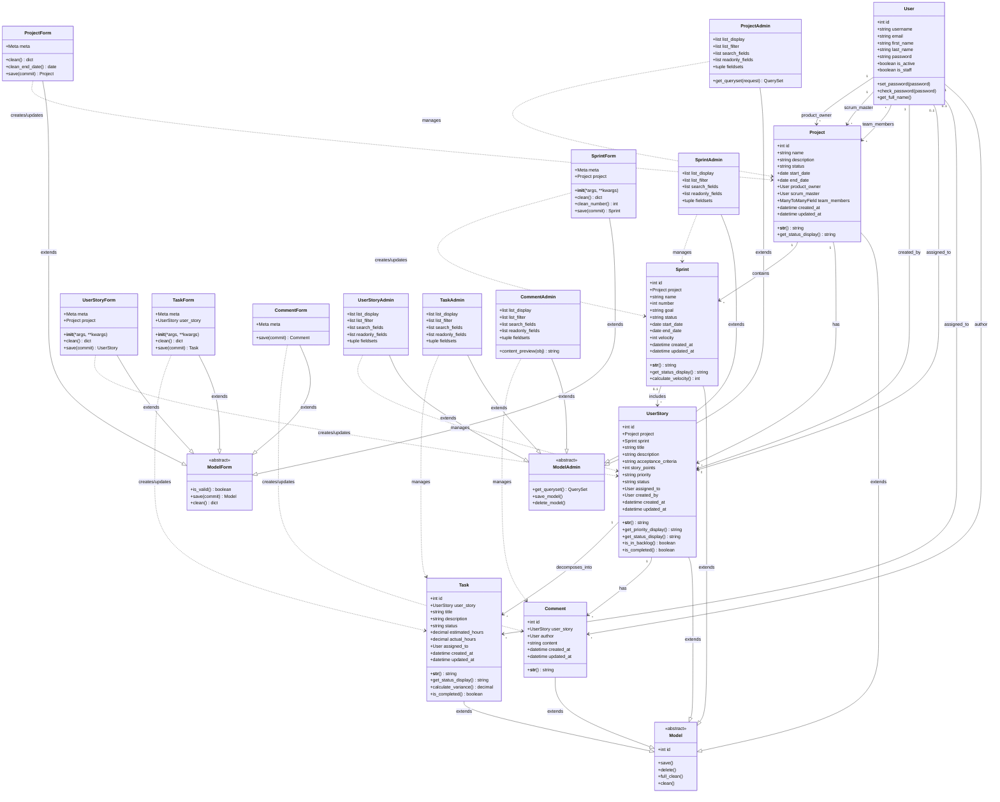

# Diagrama de Clases - Liscov Project Management

## Diagrama de Clases UML en Mermaid



---

## Descripción de Clases

### 1. Clases de Modelo (Capa de Datos)

#### 1.1 User
**Descripción**: Modelo de usuario de Django (django.contrib.auth.models.User).

**Atributos:**
- `id`: Identificador único
- `username`: Nombre de usuario único
- `email`: Correo electrónico
- `first_name`: Nombre
- `last_name`: Apellido
- `password`: Contraseña encriptada
- `is_active`: Estado de la cuenta
- `is_staff`: Permiso de acceso al admin

**Métodos:**
- `set_password(password)`: Encripta y establece contraseña
- `check_password(password)`: Verifica contraseña
- `get_full_name()`: Retorna nombre completo

**Responsabilidades:**
- Gestión de autenticación
- Almacenamiento de información de usuario
- Control de permisos

---

#### 1.2 Project
**Descripción**: Representa un proyecto Scrum completo.

**Atributos:**
- `id`: Identificador único
- `name`: Nombre del proyecto
- `description`: Descripción detallada
- `status`: Estado (PLANNING, IN_PROGRESS, ON_HOLD, COMPLETED, CANCELLED)
- `start_date`: Fecha de inicio
- `end_date`: Fecha de fin (opcional)
- `product_owner`: Usuario Product Owner
- `scrum_master`: Usuario Scrum Master
- `team_members`: Miembros del equipo (M2M)
- `created_at`: Timestamp de creación
- `updated_at`: Timestamp de actualización

**Métodos:**
- `__str__()`: Representación string del proyecto
- `get_status_display()`: Nombre legible del estado

**Responsabilidades:**
- Gestión de información del proyecto
- Asignación de roles Scrum
- Control de estados del proyecto

**Relaciones:**
- 1:N con Sprint
- 1:N con UserStory
- N:1 con User (product_owner)
- N:1 con User (scrum_master)
- M:N con User (team_members)

---

#### 1.3 Sprint
**Descripción**: Representa un sprint dentro de un proyecto.

**Atributos:**
- `id`: Identificador único
- `project`: Proyecto al que pertenece
- `name`: Nombre del sprint
- `number`: Número secuencial
- `goal`: Objetivo del sprint
- `status`: Estado (PLANNED, ACTIVE, COMPLETED, CANCELLED)
- `start_date`: Fecha de inicio
- `end_date`: Fecha de fin
- `velocity`: Puntos completados (opcional)
- `created_at`: Timestamp de creación
- `updated_at`: Timestamp de actualización

**Métodos:**
- `__str__()`: Representación string del sprint
- `get_status_display()`: Nombre legible del estado
- `calculate_velocity()`: Calcula puntos completados

**Responsabilidades:**
- Gestión de sprints
- Cálculo de velocidad
- Control de tiempos

**Relaciones:**
- N:1 con Project
- 1:N con UserStory

**Constraints:**
- unique_together: (project, number)

---

#### 1.4 UserStory
**Descripción**: Historia de usuario en formato estándar Scrum.

**Atributos:**
- `id`: Identificador único
- `project`: Proyecto al que pertenece
- `sprint`: Sprint asignado (opcional)
- `title`: Título de la historia
- `description`: Descripción completa
- `acceptance_criteria`: Criterios de aceptación
- `story_points`: Estimación de complejidad
- `priority`: Prioridad (LOW, MEDIUM, HIGH, CRITICAL)
- `status`: Estado (BACKLOG, TODO, IN_PROGRESS, IN_REVIEW, DONE, BLOCKED)
- `assigned_to`: Usuario asignado (opcional)
- `created_by`: Usuario creador
- `created_at`: Timestamp de creación
- `updated_at`: Timestamp de actualización

**Métodos:**
- `__str__()`: Representación string
- `get_priority_display()`: Nombre legible de prioridad
- `get_status_display()`: Nombre legible de estado
- `is_in_backlog()`: Verifica si está en backlog
- `is_completed()`: Verifica si está completada

**Responsabilidades:**
- Gestión de historias de usuario
- Control de estados en el flujo
- Priorización de trabajo

**Relaciones:**
- N:1 con Project
- N:1 con Sprint (opcional)
- N:1 con User (assigned_to)
- N:1 con User (created_by)
- 1:N con Task
- 1:N con Comment

---

#### 1.5 Task
**Descripción**: Tarea técnica para implementar una historia.

**Atributos:**
- `id`: Identificador único
- `user_story`: Historia a la que pertenece
- `title`: Título de la tarea
- `description`: Descripción (opcional)
- `status`: Estado (TODO, IN_PROGRESS, DONE)
- `estimated_hours`: Horas estimadas
- `actual_hours`: Horas reales (opcional)
- `assigned_to`: Usuario asignado (opcional)
- `created_at`: Timestamp de creación
- `updated_at`: Timestamp de actualización

**Métodos:**
- `__str__()`: Representación string
- `get_status_display()`: Nombre legible de estado
- `calculate_variance()`: Calcula diferencia estimado vs real
- `is_completed()`: Verifica si está completada

**Responsabilidades:**
- Gestión de tareas técnicas
- Seguimiento de horas
- Control de completitud

**Relaciones:**
- N:1 con UserStory
- N:1 con User (assigned_to)

---

#### 1.6 Comment
**Descripción**: Comentario de colaboración en historias.

**Atributos:**
- `id`: Identificador único
- `user_story`: Historia comentada
- `author`: Usuario autor
- `content`: Contenido del comentario
- `created_at`: Timestamp de creación
- `updated_at`: Timestamp de actualización

**Métodos:**
- `__str__()`: Representación string

**Responsabilidades:**
- Almacenamiento de comentarios
- Facilitación de comunicación

**Relaciones:**
- N:1 con UserStory
- N:1 con User (author)

---

### 2. Clases de Formulario (Capa de Presentación)

#### 2.1 ProjectForm
**Descripción**: Formulario para crear/editar proyectos.

**Atributos:**
- `Meta`: Configuración del formulario

**Métodos:**
- `clean()`: Validación general
- `clean_end_date()`: Validación de fecha fin
- `save(commit)`: Guarda el proyecto

**Responsabilidades:**
- Validación de datos de proyecto
- Renderizado de formulario HTML
- Procesamiento de entrada de usuario

**Relaciones:**
- Crea/actualiza instancias de Project

---

#### 2.2 SprintForm
**Descripción**: Formulario para crear/editar sprints.

**Atributos:**
- `Meta`: Configuración del formulario
- `project`: Contexto del proyecto

**Métodos:**
- `__init__(*args, **kwargs)`: Inicialización con contexto
- `clean()`: Validación general
- `clean_number()`: Validación de número de sprint
- `save(commit)`: Guarda el sprint

**Responsabilidades:**
- Validación de datos de sprint
- Sugerencia de número de sprint
- Validación de unicidad

**Relaciones:**
- Crea/actualiza instancias de Sprint

---

#### 2.3 UserStoryForm
**Descripción**: Formulario para crear/editar historias.

**Atributos:**
- `Meta`: Configuración del formulario
- `project`: Contexto del proyecto

**Métodos:**
- `__init__(*args, **kwargs)`: Inicialización con contexto
- `clean()`: Validación general
- `save(commit)`: Guarda la historia

**Responsabilidades:**
- Validación de historias de usuario
- Filtrado de sprints por proyecto
- Filtrado de usuarios por equipo

**Relaciones:**
- Crea/actualiza instancias de UserStory

---

#### 2.4 TaskForm
**Descripción**: Formulario para crear/editar tareas.

**Atributos:**
- `Meta`: Configuración del formulario
- `user_story`: Contexto de la historia

**Métodos:**
- `__init__(*args, **kwargs)`: Inicialización con contexto
- `clean()`: Validación general
- `save(commit)`: Guarda la tarea

**Responsabilidades:**
- Validación de tareas
- Filtrado de usuarios por proyecto

**Relaciones:**
- Crea/actualiza instancias de Task

---

#### 2.5 CommentForm
**Descripción**: Formulario para crear comentarios.

**Atributos:**
- `Meta`: Configuración del formulario

**Métodos:**
- `save(commit)`: Guarda el comentario

**Responsabilidades:**
- Validación de comentarios
- Renderizado de área de texto

**Relaciones:**
- Crea instancias de Comment

---

### 3. Clases de Administración (Capa de Gestión)

#### 3.1 ProjectAdmin
**Descripción**: Administrador personalizado de proyectos.

**Atributos:**
- `list_display`: Campos en listado
- `list_filter`: Filtros disponibles
- `search_fields`: Campos de búsqueda
- `readonly_fields`: Campos solo lectura
- `fieldsets`: Organización de campos

**Métodos:**
- `get_queryset(request)`: Personaliza queryset

**Responsabilidades:**
- Gestión admin de proyectos
- Configuración de interfaz
- Optimización de consultas

---

#### 3.2 SprintAdmin
**Descripción**: Administrador personalizado de sprints.

**Atributos:**
- `list_display`: Campos en listado
- `list_filter`: Filtros disponibles
- `search_fields`: Campos de búsqueda
- `readonly_fields`: Campos solo lectura
- `fieldsets`: Organización de campos

**Responsabilidades:**
- Gestión admin de sprints
- Visualización de métricas

---

#### 3.3 UserStoryAdmin
**Descripción**: Administrador personalizado de historias.

**Atributos:**
- `list_display`: Campos en listado
- `list_filter`: Filtros disponibles
- `search_fields`: Campos de búsqueda
- `readonly_fields`: Campos solo lectura
- `fieldsets`: Organización de campos

**Responsabilidades:**
- Gestión admin de historias
- Filtrado por múltiples criterios

---

#### 3.4 TaskAdmin
**Descripción**: Administrador personalizado de tareas.

**Atributos:**
- `list_display`: Campos en listado
- `list_filter`: Filtros disponibles
- `search_fields`: Campos de búsqueda
- `readonly_fields`: Campos solo lectura
- `fieldsets`: Organización de campos

**Responsabilidades:**
- Gestión admin de tareas
- Visualización de estimaciones

---

#### 3.5 CommentAdmin
**Descripción**: Administrador personalizado de comentarios.

**Atributos:**
- `list_display`: Campos en listado
- `list_filter`: Filtros disponibles
- `search_fields`: Campos de búsqueda
- `readonly_fields`: Campos solo lectura
- `fieldsets`: Organización de campos

**Métodos:**
- `content_preview(obj)`: Vista previa del contenido

**Responsabilidades:**
- Gestión admin de comentarios
- Preview de contenido largo

---

### 4. Clases Base de Django

#### 4.1 Model (Abstract)
**Descripción**: Clase base para todos los modelos Django.

**Métodos:**
- `save()`: Guarda en base de datos
- `delete()`: Elimina de base de datos
- `full_clean()`: Validación completa
- `clean()`: Validación personalizada

---

#### 4.2 ModelForm (Abstract)
**Descripción**: Clase base para formularios de modelo.

**Métodos:**
- `is_valid()`: Valida el formulario
- `save(commit)`: Guarda instancia del modelo
- `clean()`: Validación personalizada

---

#### 4.3 ModelAdmin (Abstract)
**Descripción**: Clase base para administradores de modelo.

**Métodos:**
- `get_queryset()`: Obtiene queryset personalizado
- `save_model()`: Guarda modelo desde admin
- `delete_model()`: Elimina modelo desde admin

---

## Patrones de Diseño Utilizados

### 1. Model-View-Template (MVT)
Django implementa MVT, variante de MVC:
- **Model**: Clases de modelo (Project, Sprint, etc.)
- **View**: Funciones en views.py
- **Template**: Archivos HTML

### 2. Active Record
Los modelos encapsulan datos y lógica de persistencia:
```python
project = Project(name="Mi Proyecto")
project.save()  # El objeto conoce cómo persistirse
```

### 3. Form Object
Encapsulación de validación y renderizado:
```python
form = ProjectForm(request.POST)
if form.is_valid():
    project = form.save()
```

### 4. Admin Pattern
Separación de interfaz administrativa:
```python
@admin.register(Project)
class ProjectAdmin(admin.ModelAdmin):
    # Configuración separada
```

### 5. Decorator Pattern
Uso de decoradores para funcionalidad cruzada:
```python
@login_required
def project_list(request):
    # Lógica de vista
```

---

## Principios SOLID Aplicados

### Single Responsibility Principle (SRP)
✅ Cada clase tiene una única responsabilidad:
- `Project`: Gestión de proyectos
- `ProjectForm`: Validación de formularios
- `ProjectAdmin`: Administración

### Open/Closed Principle (OCP)
✅ Extensible mediante herencia:
```python
class CustomProjectAdmin(ProjectAdmin):
    # Extensión sin modificar original
```

### Liskov Substitution Principle (LSP)
✅ Los modelos pueden sustituir a `Model`:
```python
def save_any_model(model: Model):
    model.save()  # Funciona con cualquier modelo
```

### Interface Segregation Principle (ISP)
✅ Forms específicos para cada entidad, no un mega-form

### Dependency Inversion Principle (DIP)
✅ Dependencia de abstracciones (Model, ModelForm)

---

## Relaciones entre Capas

```
┌─────────────────────────────────────────┐
│         Capa de Presentación            │
│  (Forms: ProjectForm, SprintForm, etc.) │
└────────────────┬────────────────────────┘
                 │ usa
                 ▼
┌─────────────────────────────────────────┐
│          Capa de Negocio                │
│   (Models: Project, Sprint, etc.)       │
└────────────────┬────────────────────────┘
                 │ persiste en
                 ▼
┌─────────────────────────────────────────┐
│         Capa de Datos                   │
│        (Base de Datos SQLite)           │
└─────────────────────────────────────────┘

┌─────────────────────────────────────────┐
│      Capa de Administración             │
│  (Admin: ProjectAdmin, etc.)            │
└────────────────┬────────────────────────┘
                 │ gestiona
                 ▼
               Models
```

---

## Conclusión

El diagrama de clases muestra:

✅ **Separación de responsabilidades** clara entre modelos, formularios y administración
✅ **Herencia** apropiada de clases base de Django
✅ **Relaciones** bien definidas entre entidades
✅ **Encapsulación** de lógica de negocio en modelos
✅ **Validación** distribuida entre modelos y formularios
✅ **Extensibilidad** mediante herencia y composición

Este diseño permite mantener el código organizado, testeable y fácil de extender.
