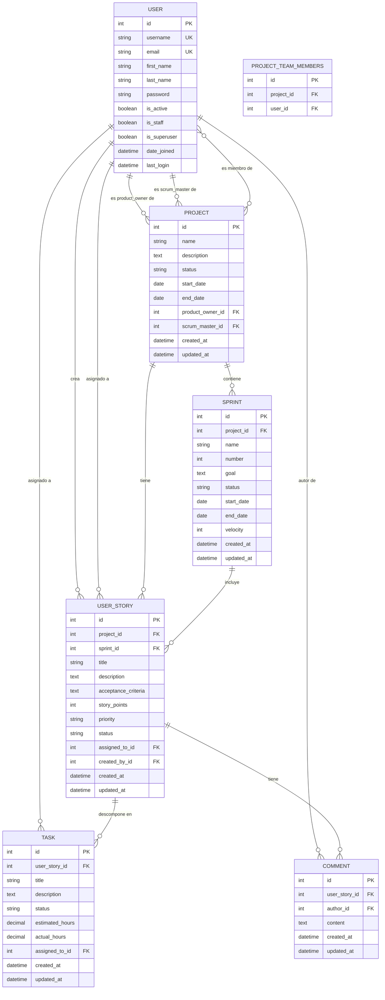

# Diagrama Entidad-Relación - Liscov Project Management

## Diagrama ER en Mermaid



---

## Descripción Detallada de Entidades

### 1. USER (Usuario)
**Descripción**: Representa a los usuarios del sistema. Utiliza el modelo User de Django Auth.

**Atributos:**
- `id` (PK): Identificador único del usuario
- `username` (UK): Nombre de usuario único
- `email` (UK): Correo electrónico único
- `first_name`: Nombre del usuario
- `last_name`: Apellido del usuario
- `password`: Contraseña encriptada
- `is_active`: Indica si la cuenta está activa
- `is_staff`: Indica si puede acceder al admin
- `is_superuser`: Indica si tiene todos los permisos
- `date_joined`: Fecha de registro
- `last_login`: Última fecha de inicio de sesión

**Roles en el Sistema:**
- Product Owner de proyectos
- Scrum Master de proyectos
- Miembro del equipo
- Creador de historias de usuario
- Asignado a historias y tareas
- Autor de comentarios

---

### 2. PROJECT (Proyecto)
**Descripción**: Representa un proyecto Scrum completo con sus roles y configuración.

**Atributos:**
- `id` (PK): Identificador único del proyecto
- `name`: Nombre del proyecto
- `description`: Descripción detallada del proyecto
- `status`: Estado actual del proyecto
  - PLANNING: Planificación
  - IN_PROGRESS: En Progreso
  - ON_HOLD: En Pausa
  - COMPLETED: Completado
  - CANCELLED: Cancelado
- `start_date`: Fecha de inicio del proyecto
- `end_date`: Fecha de finalización (opcional)
- `product_owner_id` (FK): Usuario que es Product Owner
- `scrum_master_id` (FK): Usuario que es Scrum Master
- `created_at`: Fecha de creación del registro
- `updated_at`: Fecha de última actualización

**Relaciones:**
- Pertenece a un Product Owner (User)
- Pertenece a un Scrum Master (User)
- Tiene múltiples miembros del equipo (User) - Relación M:N
- Contiene múltiples Sprints
- Tiene múltiples Historias de Usuario

**Reglas de Negocio:**
- El Product Owner y Scrum Master deben ser usuarios existentes
- La fecha de fin debe ser posterior a la fecha de inicio
- Un proyecto debe tener al menos un Product Owner y un Scrum Master
- Los miembros del equipo pueden ser asignados o removidos libremente

---

### 3. SPRINT (Sprint)
**Descripción**: Representa un sprint dentro de un proyecto Scrum, con duración fija y objetivo específico.

**Atributos:**
- `id` (PK): Identificador único del sprint
- `project_id` (FK): Proyecto al que pertenece
- `name`: Nombre descriptivo del sprint
- `number`: Número secuencial del sprint dentro del proyecto
- `goal`: Objetivo/meta del sprint
- `status`: Estado actual del sprint
  - PLANNED: Planificado
  - ACTIVE: Activo
  - COMPLETED: Completado
  - CANCELLED: Cancelado
- `start_date`: Fecha de inicio del sprint
- `end_date`: Fecha de finalización del sprint
- `velocity`: Puntos de historia completados (opcional)
- `created_at`: Fecha de creación del registro
- `updated_at`: Fecha de última actualización

**Relaciones:**
- Pertenece a un Proyecto
- Contiene múltiples Historias de Usuario

**Reglas de Negocio:**
- El número de sprint debe ser único dentro del proyecto
- La fecha de fin debe ser posterior a la fecha de inicio
- Solo puede haber un sprint activo por proyecto
- La velocidad se calcula al finalizar el sprint
- Los sprints típicamente duran 1-4 semanas

**Constraint Único:**
- `unique_together`: (project_id, number)

---

### 4. USER_STORY (Historia de Usuario)
**Descripción**: Representa una historia de usuario en formato estándar: "Como [rol], quiero [funcionalidad] para [beneficio]".

**Atributos:**
- `id` (PK): Identificador único de la historia
- `project_id` (FK): Proyecto al que pertenece
- `sprint_id` (FK): Sprint asignado (opcional, puede estar en backlog)
- `title`: Título breve de la historia
- `description`: Descripción completa en formato estándar
- `acceptance_criteria`: Criterios para considerar la historia completa
- `story_points`: Estimación de complejidad (1-100)
- `priority`: Prioridad de la historia
  - LOW: Baja
  - MEDIUM: Media
  - HIGH: Alta
  - CRITICAL: Crítica
- `status`: Estado en el flujo de trabajo
  - BACKLOG: Product Backlog
  - TODO: Por Hacer
  - IN_PROGRESS: En Progreso
  - IN_REVIEW: En Revisión
  - DONE: Completada
  - BLOCKED: Bloqueada
- `assigned_to_id` (FK): Usuario asignado (opcional)
- `created_by_id` (FK): Usuario que creó la historia
- `created_at`: Fecha de creación del registro
- `updated_at`: Fecha de última actualización

**Relaciones:**
- Pertenece a un Proyecto
- Puede pertenecer a un Sprint (o estar en backlog)
- Asignada a un Usuario (opcional)
- Creada por un Usuario
- Se descompone en múltiples Tareas
- Tiene múltiples Comentarios

**Reglas de Negocio:**
- Debe pertenecer a un proyecto
- Puede estar sin sprint (Product Backlog)
- Los story points deben estar entre 1 y 100
- Solo puede estar asignada a miembros del equipo del proyecto
- El creador debe ser un usuario válido

---

### 5. TASK (Tarea)
**Descripción**: Representa una tarea técnica específica para implementar una historia de usuario.

**Atributos:**
- `id` (PK): Identificador único de la tarea
- `user_story_id` (FK): Historia de usuario a la que pertenece
- `title`: Título de la tarea
- `description`: Descripción detallada (opcional)
- `status`: Estado de la tarea
  - TODO: Por Hacer
  - IN_PROGRESS: En Progreso
  - DONE: Completada
- `estimated_hours`: Horas estimadas para completar
- `actual_hours`: Horas reales trabajadas (opcional)
- `assigned_to_id` (FK): Usuario asignado (opcional)
- `created_at`: Fecha de creación del registro
- `updated_at`: Fecha de última actualización

**Relaciones:**
- Pertenece a una Historia de Usuario
- Asignada a un Usuario (opcional)

**Reglas de Negocio:**
- Debe pertenecer a una historia de usuario
- Las horas estimadas y reales deben ser positivas
- Solo puede estar asignada a miembros del equipo
- Las horas reales se completan al finalizar la tarea

---

### 6. COMMENT (Comentario)
**Descripción**: Representa comentarios de colaboración en historias de usuario.

**Atributos:**
- `id` (PK): Identificador único del comentario
- `user_story_id` (FK): Historia de usuario comentada
- `author_id` (FK): Usuario autor del comentario
- `content`: Contenido del comentario
- `created_at`: Fecha de creación del comentario
- `updated_at`: Fecha de última actualización

**Relaciones:**
- Pertenece a una Historia de Usuario
- Escrito por un Usuario (autor)

**Reglas de Negocio:**
- Debe pertenecer a una historia de usuario
- Debe tener un autor válido
- El contenido no puede estar vacío
- Los comentarios son ordenados cronológicamente

---

### 7. PROJECT_TEAM_MEMBERS (Tabla Intermedia)
**Descripción**: Tabla intermedia para la relaciónMany-to-Many entre Project y User (miembros del equipo).

**Atributos:**
- `id` (PK): Identificador único
- `project_id` (FK): Proyecto
- `user_id` (FK): Usuario miembro

**Características:**
- Tabla generada automáticamente por Django
- Permite la relación muchos a muchos
- Un usuario puede pertenecer a múltiples proyectos
- Un proyecto puede tener múltiples miembros

---

## Tipos de Relaciones

### Relaciones 1:N (Uno a Muchos)

1. **USER → PROJECT (como Product Owner)**
   - Un usuario puede ser Product Owner de múltiples proyectos
   - Un proyecto tiene exactamente un Product Owner

2. **USER → PROJECT (como Scrum Master)**
   - Un usuario puede ser Scrum Master de múltiples proyectos
   - Un proyecto tiene exactamente un Scrum Master

3. **PROJECT → SPRINT**
   - Un proyecto puede tener múltiples sprints
   - Un sprint pertenece a un solo proyecto

4. **PROJECT → USER_STORY**
   - Un proyecto puede tener múltiples historias de usuario
   - Una historia pertenece a un solo proyecto

5. **SPRINT → USER_STORY**
   - Un sprint puede contener múltiples historias
   - Una historia puede estar en un sprint (o ninguno si está en backlog)

6. **USER_STORY → TASK**
   - Una historia puede tener múltiples tareas
   - Una tarea pertenece a una sola historia

7. **USER_STORY → COMMENT**
   - Una historia puede tener múltiples comentarios
   - Un comentario pertenece a una sola historia

8. **USER → USER_STORY (creador)**
   - Un usuario puede crear múltiples historias
   - Una historia tiene un solo creador

9. **USER → USER_STORY (asignado)**
   - Un usuario puede estar asignado a múltiples historias
   - Una historia puede estar asignada a un solo usuario (o ninguno)

10. **USER → TASK (asignado)**
    - Un usuario puede estar asignado a múltiples tareas
    - Una tarea puede estar asignada a un solo usuario (o ninguno)

11. **USER → COMMENT (autor)**
    - Un usuario puede escribir múltiples comentarios
    - Un comentario tiene un solo autor

### Relaciones M:N (Muchos a Muchos)

1. **PROJECT ↔ USER (team_members)**
   - Un proyecto puede tener múltiples miembros del equipo
   - Un usuario puede ser miembro de múltiples proyectos
   - Implementada mediante tabla intermedia PROJECT_TEAM_MEMBERS

---

## Cardinalidades Detalladas

```
USER (1) ──────< (N) PROJECT [product_owner]
USER (1) ──────< (N) PROJECT [scrum_master]
USER (N) ──────< (M) PROJECT [team_members]
USER (1) ──────< (N) USER_STORY [created_by]
USER (0..1) ───< (N) USER_STORY [assigned_to]
USER (0..1) ───< (N) TASK [assigned_to]
USER (1) ──────< (N) COMMENT [author]

PROJECT (1) ───< (N) SPRINT
PROJECT (1) ───< (N) USER_STORY

SPRINT (0..1) ─< (N) USER_STORY

USER_STORY (1) < (N) TASK
USER_STORY (1) < (N) COMMENT
```

**Leyenda:**
- `(1)`: Exactamente uno
- `(0..1)`: Cero o uno
- `(N)`: Uno o muchos
- `(M)`: Muchos

---

## Índices Recomendados

Para optimizar el rendimiento de las consultas:

### Índices Primarios (PK)
- Automáticamente creados por Django en todos los `id`

### Índices de Clave Foránea (FK)
- Automáticamente creados por Django en todas las FK

### Índices Únicos
- `USER.username`
- `USER.email`
- `(PROJECT.id, SPRINT.number)` - Composite unique

### Índices Adicionales Recomendados
```sql
-- Para búsquedas frecuentes
CREATE INDEX idx_project_status ON PROJECT(status);
CREATE INDEX idx_sprint_status ON SPRINT(status);
CREATE INDEX idx_userstory_status ON USER_STORY(status);
CREATE INDEX idx_userstory_priority ON USER_STORY(priority);
CREATE INDEX idx_task_status ON TASK(status);

-- Para ordenamiento por fechas
CREATE INDEX idx_project_created ON PROJECT(created_at);
CREATE INDEX idx_userstory_created ON USER_STORY(created_at);
CREATE INDEX idx_comment_created ON COMMENT(created_at);
```

---

## Restricciones de Integridad

### Restricciones de Clave Primaria (PK)
- Todas las tablas tienen `id` como PK auto-incremental

### Restricciones de Clave Foránea (FK)

```sql
-- PROJECT
FK: product_owner_id → USER(id) ON DELETE PROTECT
FK: scrum_master_id → USER(id) ON DELETE PROTECT

-- SPRINT
FK: project_id → PROJECT(id) ON DELETE CASCADE

-- USER_STORY
FK: project_id → PROJECT(id) ON DELETE CASCADE
FK: sprint_id → SPRINT(id) ON DELETE SET NULL
FK: assigned_to_id → USER(id) ON DELETE SET NULL
FK: created_by_id → USER(id) ON DELETE PROTECT

-- TASK
FK: user_story_id → USER_STORY(id) ON DELETE CASCADE
FK: assigned_to_id → USER(id) ON DELETE SET NULL

-- COMMENT
FK: user_story_id → USER_STORY(id) ON DELETE CASCADE
FK: author_id → USER(id) ON DELETE CASCADE

-- PROJECT_TEAM_MEMBERS
FK: project_id → PROJECT(id) ON DELETE CASCADE
FK: user_id → USER(id) ON DELETE CASCADE
```

### Tipos de ON DELETE

- **CASCADE**: Al eliminar el padre, elimina los hijos
- **PROTECT**: Previene eliminación si tiene hijos
- **SET NULL**: Al eliminar el padre, establece NULL en hijos

---

## Consideraciones de Diseño

### 1. Normalización
El modelo está en **Tercera Forma Normal (3NF)**:
- ✅ No hay grupos repetidos
- ✅ Todos los atributos dependen de la clave primaria
- ✅ No hay dependencias transitivas

### 2. Desnormalización Estratégica
Algunos campos podrían desnormalizarse para mejorar rendimiento:
- `velocity` en Sprint (calculado, pero almacenado)
- `story_count` en Project (podría calcularse con COUNT)

### 3. Soft Delete
No implementado actualmente, pero se podría agregar:
```python
deleted_at = models.DateTimeField(null=True, blank=True)
is_deleted = models.BooleanField(default=False)
```

### 4. Auditoría
Implementado parcialmente con:
- `created_at`: Fecha de creación
- `updated_at`: Fecha de última modificación

Se podría extender con:
- `created_by`: Usuario creador
- `updated_by`: Usuario que modificó
- `version`: Control de versiones

---

## Consultas SQL Comunes

### 1. Obtener todos los proyectos de un usuario
```sql
SELECT DISTINCT p.*
FROM PROJECT p
LEFT JOIN PROJECT_TEAM_MEMBERS ptm ON p.id = ptm.project_id
WHERE p.product_owner_id = :user_id
   OR p.scrum_master_id = :user_id
   OR ptm.user_id = :user_id;
```

### 2. Obtener historias de un sprint con sus tareas
```sql
SELECT
    us.id,
    us.title,
    us.status,
    COUNT(t.id) as task_count,
    SUM(CASE WHEN t.status = 'DONE' THEN 1 ELSE 0 END) as completed_tasks
FROM USER_STORY us
LEFT JOIN TASK t ON us.id = t.user_story_id
WHERE us.sprint_id = :sprint_id
GROUP BY us.id, us.title, us.status;
```

### 3. Calcular velocidad de un sprint
```sql
SELECT SUM(story_points) as total_velocity
FROM USER_STORY
WHERE sprint_id = :sprint_id
  AND status = 'DONE';
```

### 4. Obtener backlog del producto
```sql
SELECT *
FROM USER_STORY
WHERE project_id = :project_id
  AND sprint_id IS NULL
ORDER BY priority DESC, created_at ASC;
```

---

## Migración del Modelo

### Comandos Django ORM

```python
# Crear migraciones
python manage.py makemigrations

# Aplicar migraciones
python manage.py migrate

# Ver SQL de migración
python manage.py sqlmigrate projects 0001

# Ver estado de migraciones
python manage.py showmigrations
```

---

## Conclusión

Este modelo de datos implementa completamente la metodología Scrum con:

✅ **Separación clara de responsabilidades**
✅ **Integridad referencial**
✅ **Flexibilidad para cambios**
✅ **Optimización de consultas**
✅ **Auditoría básica**
✅ **Escalabilidad**

El diseño permite gestionar múltiples proyectos, sprints, historias y tareas de manera eficiente, manteniendo la trazabilidad y facilitando la colaboración del equipo.
